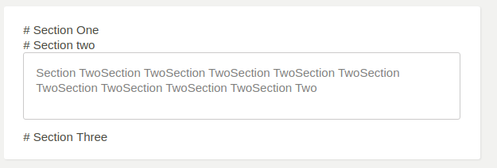
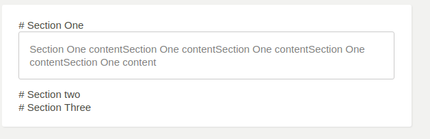

### Preview



### Uses
```
import ToggleSection from 'toggleSections';

.
.
.
	<ToggleSection
		checkBox={true}
	>
		<div>
			<div>
				# Authenticator app <span>Recommended</span>
			</div>
			<div>
				{App.t('auth.authenticator.app.title')}
				<b>Recommended authenticator apps</b><i onClick={this.showInfo}>Replace me with ingo icon</i>
				<div>
					<label>
						QRCODE
					</label>
					<label>Enter the 6-digit code that the application generates</label>
					<input name='code' id='code' />
					<Button value='Enable two-factor authentication' />
				</div>
			</div>
		</div>

		<div>
			<div>
				# SMS/Text message
			</div>
			<div>
				<p>{App.t('')}</p>
			</div>
		</div>

		<div>
			<div>
				# Phone call
			</div>
			<div>
				<i onClick={this.showInfo}>Replace me with ingo icon</i>
				description description description description description description
				description description description description description description
				description description description description
			</div>
		</div>
	</ToggleSection>
	.
	.
	.

	```
